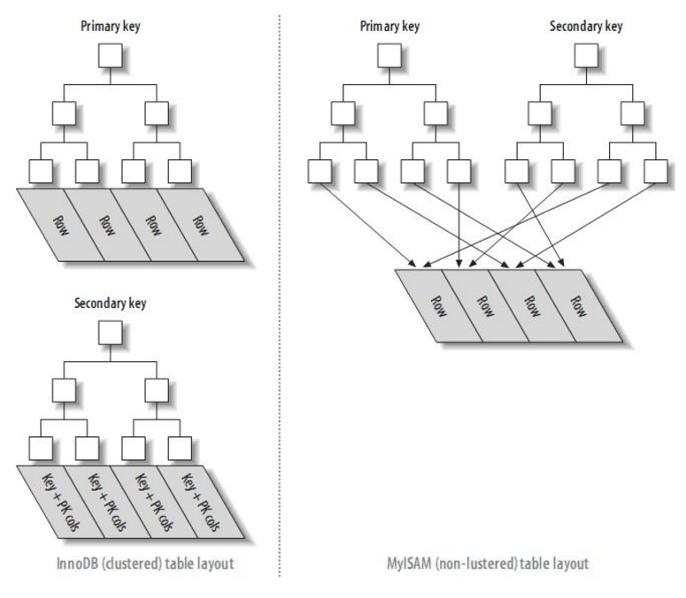
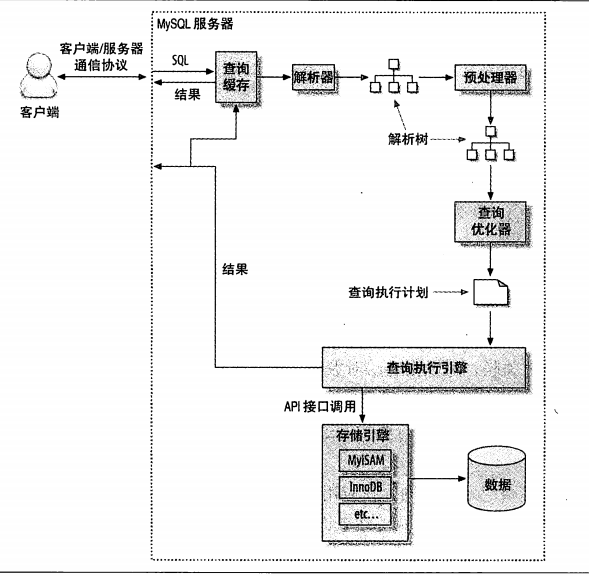

## 3.3 剖析MySQL查询
### 3.3.1 剖析服务器负载
- 慢查询日志 （是当前开销最低、精度最高的测量查询时间的工具，只需在收集数据期间开启即可）  
- 可以设置long_query_time为0来捕获所有的查询，查询的响应时间可以做到微秒级  
- Percona Server的慢查询日志比MySQL官方版本记录了更多细节  
- [在权限不足等情况导致无法在服务器上记录查询时，可以使用Percona Toolkit的pt-query-digest工具，结合--processlist选项记录查询第一次出现和消失的时间，或者先通过tcpdump将网络包数据保存到磁盘，然后使用--type=tcpdump选项来解析并分析查询。]  
- 使用慢查询日志应该首先生成剖析报告，如有需要，再去查看日志相关部分。推荐使用pt-query-digest工具生成剖析报告，剖析报告的后面包含了每种查询的详细报告。  

### 3.3.2 剖析单条查询

**1. 使用 SHOW PROFILE** （默认禁用，可通过服务器变量在会话级别修改）  

    mysql> SET profiling = 1;
    mysql> query statement...
    mysql> SHOW PROFILES;
    mysql> SHOW PROFILE FOR QUERY (Query_ID)
    
也可以直接查询INFORMATION_SCHEMA中对应的表，按需格式化输出，找出最耗时的操作：  

    mysql> SET @query_id = 1;
    mysql> SELECT STATE, SUM(DURATION) AS Total_Run, 
        ->       ROUND(
        ->              100 * SUM(DURATION) / 
        ->                    (SELECT SUM(DURATION)
        ->                     FROM INFORMATION_SCHEMA.PROFILING
        ->                     WHERE QUERY_ID = @query_id),
        ->              2) AS Percent_Run,
        ->       COUNT(*) AS Calls,
        ->       SUM(DURATION) / COUNT(*) AS "Run/Call"
        -> FROM INFORMATION_SCHEMA.PROFILING
        -> WHERE QUERY_ID = @query_id
        -> GROUP BY STATE
        -> ORDER BY Total_Run DESC;
        
**2. 使用 SHOW STATUS**  
SHOW STATUS 返回基于某连接的会话级别的计数器和服务器级别的全局计数器  
SHOW GLOBAL STATUS 只返回服务器级别的全局计数器  
将会话级别的计数器重置为0：  

    mysql> FLUSH STATUS;
执行某语句：

    mysql> query statement...
查看句柄计数器、临时文件和表计数器：

    mysql> SHOW STATUS WHERE Variable_name LIKE 'Handler%' OR Variable_name LIKE 'Created%';
    
**3. 使用慢查询日志**  
剖析报告的每个Query的开头会显示其对应部分所在的日志字节位置，可以使用命令 `tail -c +{byte_number} /path/to/query.log | head -n100` 直接查看相关细节。  
**4. 使用Performance Schema**

## 3.4 诊断间歇性问题
### 3.4.1 判断是单条查询问题还是服务器问题

**1. 使用 SHOW GLOBAL STATUS**  
以较高的频率（如一秒一次）执行该命令捕获数据，如：

    $ mysqladmin ext  -i1 | awk '
        /Queries/{q=$4-qp;qp=$4}
        /Threads_connected/{tc=$4}
        /Threads_running/{printf "%5d %5d %5d\n", q, tc, $4}'
        
**2. 使用 SHOW PROCESSLIST**  
1) 命令行：

    $ mysql -e 'SHOW PROCESSLIST\G' | grep State: | sort | uniq -c | sort -rn
    
2) 查询 INFORMATION_SCHEMA.PROCESSLIST表  
3) 使用innotop工具以较高的频率刷新，观察屏幕上出现的不正常查询堆积

**3. 使用查询日志**  
开启慢查询日志并在全局级别设置long_query_time为0  
要注意找到吞吐量突然下降时间段的日志，使用好的工具帮助诊断，如根据MySQL每秒将当前时间写入日志中的模式统计每秒的查询数量：

    $ awk '/^# Time:/{print $3, $4, c;c=0}/^# User/{c++}' slow-query.log

### 3.4.2 捕获诊断数据  
- 监控服务器，当达到开始收集数据的触发条件时，使用收集数据的工具：Percona Toolkit中的pt-stalk和pt-collect  
- Linux服务器内部诊断的重要工具：oprofile
- 关于等待分析的性能瓶颈分析工具：gdb的堆栈跟踪，结合poor man's profiler (Percona Toolkit中也有类似的工具pt-pmp)
- iostat

# 4 Schema 与数据类型优化
## 4.1 选择优化的数据类型  
- 尽量使用可以正确存储数据的最小数据类型
- 使用MySQL内建的类型，简单的数据类型比较好
- 最好指定列为NOT NULL，尤其是要建索引的列（不过InnoDB有例外）

## 4.3 范式和反范式
### 4.3.1 范式的优点和缺点
- 范式化的更新操作通常比反范式化要快
- 当数据较好的范式化时，就只有很少或者没有重复数据，所以只需要修改更少的数据
- 范式化的表通常更小，可以更好地放在内存里，所以执行操作会更快
- 很少有多余的数据意味着检索列表数据时更少需要DISTINCT或者GROUP BY语句
- 缺点：通常需要关联，代价较高

### 4.3.2 反范式的优点和缺点
- 可以很好地避免关联
- 单独的表也能使用更有效的索引策略

### 4.3.3 混用范式化和反范式化

# 5 创建高性能的索引
索引优化应该是对查询性能优化最有效的手段了，索引能够将查询性能提高几个数量级

## 5.1 索引基础
如果索引包含多个列，则列的顺序也十分重要，因为MySQL只能高效地使用索引的最左前缀列  
MySQL中的索引是在存储引擎层实现的  
MySQL中索引也叫做key
### 索引的类型  
- **B-Tree索引**  
  - 大多数MySQL引擎都支持
  - InnoDB使用的是B+Tree
  - 对索引列是顺序组织存储的，很适合查找范围数据
  - 对于多个列构成的索引，索引对多个值排序的依据是CREATE TABLE语句中定义索引时列的顺序
  - 查询类型：  
    - 全值匹配（匹配索引中定义的所有列）；  
    - 匹配最左前缀；  
    - 匹配列前缀（索引第一列的开头部分）；  
    - 匹配索引第一列的范围值；  
    - 精确匹配索引的前面列并范围匹配后面列；  
    - 只访问索引的查询（无需访问数据行，索引覆盖）
  - 限制：  
    - 只能从索引的最左列开始查找，也只能按照列的开头而不是结尾查找；  
    - 查找不能跳过索引中的列；  
    - 如果查询中有某个列的范围查询，则其右边所有列都无法使用索引来优化查找。如果范围查询列值的数量有限，可以通过使用多个等于条件（如IN()）来代替范围条件  
- **哈希索引**  
  - 只有精确匹配所有列的查询才有效
  - 对于每一行的所有索引列计算一个hash code，存在哈希表中
  - 只有Memory引擎显式支持（也是其默认索引，Memory引擎也支持B-Tree索引）
  - 哈希查找的速度非常快
  - 限制：  
    - 索引值不是顺序存储的，因此无法用于排序；  
    - 使用全部索引列计算哈希值，因此不支持部分索引列匹配查找； 
    - 只支持等值比较查询，不支持范围查询；  
    - 当出现哈希冲突时，存储引擎必须遍历链表中所有的行指针，逐个进行比较；  
    - 如果哈希冲突很多，索引的维护代价就很高  
  - 如果存储引擎不支持哈希索引，可以在B-Tree基础上创建伪哈希索引，仍然使用B-Tree进行查找，但是使用的是哈希值进行比较和查找。对于较长字符串的列，新加一列存储字符串对应的哈希值（可以手动或使用触发器维护该列），并在该列建B-Tree索引，在查询语句的WHERE条件中带入哈希值和对应列值，查询速度会比在长字符串列建立索引提升很多。  
- **全文索引**
  - 查找的是文本中的关键词

## 5.2 索引的优点  
- MySQL使用B-Tree索引可以用来做ORDER BY，GROUP BY和DISTINCT操作
- 索引大大减少了服务器需要扫描的数据量
- 索引可以帮助服务器避免排序和临时表
- 索引可以将随机I/O变为顺序I/O

## 5.3 高性能的索引策略  
- 独立的列  
  索引列不能是表达式的一部分，不能是函数的参数，应始终将索引列单独放在比较符号的一侧
- 前缀索引和索引选择性  
  - 如果要索引很长的字符列，除了可以使用伪哈希索引，还可以使用前缀索引，选择合适的长度索引列开始的部分字符，使得前缀索引的选择性接近于完整列的选择性：  
`KEY(index_column_name(prefix_length))`  
缺点：MySQL无法使用前缀索引做ORDER BY和GROUP BY，也无法使用前缀索引做覆盖扫描
  - 索引的选择性：不重复的索引数和数据表的记录总数的比值，选择性越高则查询效率越高  
- 多列索引  
  需要判断到底需要多个列上建立单独的索引还是建立一个多列索引
- 选择合适的索引列顺序  
  根据查询的顺序、排序和分组的需求、每列的选择性、列值的分布来选择索引列的顺序
- 聚簇索引  
  - 是一种数据存储方式  
  - 数据行实际存放在索引的叶子页中
  - 一个表只能有一个聚簇索引
  - InnoDB通过主键聚集数据（若没有主键，会选择一个唯一非空索引，或者隐式定义一个主键）
  - 优点：  
    - 可以把相关数据保存在一起，读取相关数据时减少磁盘I/O；  
    - 从聚簇索引中获取数据更快；  
    - 使用覆盖索引扫描的查询可以直接使用页节点中的主键值
  - 缺点：  
    - 聚簇索引提高了I/O密集型应用的性能，但如果数据全都放在内存中，就没什么优势了；  
    - 插入速度严重依赖于插入顺序。按照单调增的主键的顺序插入是加载数据到InnoDB表中最快的方式，否则，会导致大量的磁盘随机I/O和页分裂，时间边长，空间占用增加，加载完数据后最好使用OPTIMIZE TABLE命令重新组织一下表；  
    - 更新聚簇索引列的代价很高；  
    - 表插入新行，或者主键被更新导致需要移动行时，可能面临页分裂的问题，导致占用更多的磁盘空间；  
    - 可能导致全表扫描变慢，尤其是行比较稀疏，或者由于页分裂导致数据存储不连续的时候；  
    - 二级索引（即非聚簇索引）可能比想象的要更大，因为二级索引的叶子结点包含了引用行的主键列；  
    - 二级索引访问需要两次索引查找
  - InnoDB和MyISAM的数据分布对比  
    - MyISAM的索引和数据是分开存储的，其主键索引和其他索引在结构上相同
    - InnoDB支持聚簇索引，聚簇索引的每一个叶子节点都包含了主键值、事务ID、用于事务和MVCC的回滚指针以及所有的剩余列；InnoDB的二级索引和聚簇索引很不同，其二级索引的叶子节点中存储的是主键值，这会让二级索引占用更多的空间，但好处是，减少了当出现行移动或者数据分页时二级索引的维护工作  
    
- 覆盖索引
  - 如果一个索引包含所有需要查询的字段的值，则称之为“覆盖索引”
  - 优点：  
    - 只需要读取索引，极大减少数据访问量
    - 因为索引按照列值顺序存储，进行范围查询的I/O很少
    - MyISAM等存储引擎在内存中只缓存索引，数据则依赖于操作系统来缓存，因此访问数据需要一次系统调用，可能会导致性能问题
    - 由于InnoDB的聚簇索引，如果二级索引能够覆盖查询，可以避免对主键索引的二次查询
  - MySQL只能使用B-Tree索引做覆盖索引
  - 当一个查询能被索引覆盖时，在EXPLAIN的Extra列可以看到“Using index”的信息
  - 在大多数存储引擎中，覆盖索引只能覆盖那些只访问索引中定义的部分列的查询，但是对于InnoDB，其二级索引的叶子节点包含了主键的值，因此二级索引可以覆盖对于主键的查询
- 使用索引扫描来做排序  
  - MySQL生成有序结果的两种方式：通过排序操作；按索引顺序扫描。如果EXPLAIN中的type列的值为“index”，则说明MySQL使用了索引扫描来做排序。
  - 扫描索引本身是很快的，但如果索引不能覆盖查询所需的全部列，则需要在表中查找行，这基本都是随机I/O，此时按索引顺序读取数据的速度通常比顺序地全表扫描慢
  - 可以使用同一个索引既满足排序，又用于查找行，如果索引可以同时满足这两种任务，是最好的
  - 只有当索引列的顺序和ORDER BY子句的顺序完全一致，并且所有列的排序方向（ASC/DESC）都一样时，才能使用索引来对结果做排序；如果查询需要关联多张表，则只有当ORDER BY子句引用的字段全部为第一个表时，才能使用索引做排序；ORDER BY子句和查找型查询的限制相同--需要满足索引的最左前缀要求。否则，MySQL都要执行排序操作，而无法利用索引排序。
  - 如果在WHERE或者JOIN子句中为前导列指定了常量，ORDER BY子句就可以不满足对索引的最左前缀的要求
- （前缀）压缩索引
  - MyISAM使用前缀压缩来减小索引的大小，从而让更多的索引可以放入内存中，在某些情况下能极大提高性能
  - 压缩块使用更少的空间，代价是某些操作可能更慢，因为MyISAM查找时只能对索引块从头开始扫描
  - 对于CPU密集型应用，压缩索引使得MyISAM在查找索引上要慢好几倍；对于I/O密集型应用，对某些查询会带来好处
- 关于冗余和重复索引  
  - 重复索引是指在相同的列上按照相同的顺序创建的**相同类型**的索引，应该**避免**创建重复索引
  - 如果一个索引是另一个相同类型索引的前缀，则该索引为冗余索引；或者将InnoDB的二级索引扩展，增加主键列--（idx，ID），由于二级索引包含主键列，这也是冗余的。大多数情况下都不需要冗余索引，但也有时候因为扩展已有的索引会导致其变得太大，影响其他使用该索引的查询的性能，而使用冗余索引
  - 表中的索引越多，会导致INSERT、UPDATE、DELETE等操作的速度变慢
  - 使用Percona Toolkit中的pt-duplicate-key-checker找出冗余和重复索引，使用pt-upgrade工具检查计划中的索引变更
- 关于未使用的索引  
  - 应该删除未使用的索引（注：有些索引虽然未被查询使用，但功能相当于唯一性约束）
  - 使用pt-index-usage工具，找出未使用的索引
- 关于索引和锁
  - 索引可以让查询锁定更少的行，提升效率
  - 即使使用了索引，InnoDB也有可能锁定一些不需要的数据，返回给服务器层使用WHERE等语句进行过滤
  - InnoDB在二级索引上使用共享（读）锁，但访问主键索引需要排他（写）锁
## 5.5 维护索引和表
### 5.5.1 找到并修复损坏的表
- 使用CHECK TABLE命令通常能够找出大多数的表和索引的错误
- 可以使用REPAIR TABLE来修复损坏的表
- InnoDB的设计保证了它并不容易被损坏，如果发生损坏，需要立刻调查原因。可能是数据库的硬件问题（内存或磁盘问题）、DBA的错误操作（在MySQL外部操作了数据文件、使用rsync备份InnoDB）等，不存在什么查询能让InnoDB表损坏

### 5.5.2 更新索引统计信息
- MySQL的查询优化器会通过两个API来了解存储引擎的索引值的分布信息，以决定如何使用索引。如果存储引擎向优化器提供的扫描行数的信息不准确，则优化器会使用索引统计信息来估算扫描行数。
- 可以运行ANALYZE TABLE重新生成索引统计信息
- 不同存储引擎：  
  - Memory引擎不存储索引统计信息
  - MyISAM将索引统计信息存储在磁盘中，ANALYZE TABLE需要进行一次全索引扫描来计算索引基数，整个过程需要锁表
  - InnoDB不在磁盘存储索引统计信息，而是通过随机的索引访问进行评估并将其存储在内存中。InnoDB在表首次打开、执行ANALYZE TABLE、表的大小发生非常大的变化、打开某些INFORMATION_SCHEMA表、使用SHOW TABLE STATUS和SHOW INDEX、MySQL客户端开启自动补全功能的时候，都会触发索引统计信息的更新
  - 可以使用SHOW INDEX FROM table命令查看存储引擎估算的索引的基数（索引列有多少个不同的取值）。还可以通过INFORMATION_SCHEMA.STATISTICS表查询

### 5.5.3 减少索引和数据的碎片
- 碎片化的索引可能会以很差或无序的方式存储在磁盘上
- 三种类型的数据碎片：  
  - 行碎片：数据行被存储在多个地方的多个片段中
  - 行间碎片：逻辑上顺序的页或行在磁盘上不是顺序存储的
  - 剩余空间碎片：数据页中有大量的剩余空间
- MyISAM表，这三类碎片化都可能发生，但InnoDB不会出现短小的行碎片
- 可通过执行OPTIMIZE TABLE或者导出再导入的方式来重新整理数据。MyISAM可通过排序算法重建索引的方式消除索引碎片，InnoDB可以通过先删除、再重新创建索引的方式消除索引碎片
- 应该通过一些实际测量而不是随意假设来确定是否需要消除索引和表的碎片化，也要考虑数据是否已经到达稳定状态

# 6 查询性能优化
## 6.2 慢查询基础：优化数据访问
查询性能低下最基本的原因是访问的数据太多。对于低效的查询，通过两个步骤分析：
- 确认应用程序是否在检索大量超过需要的数据（访问了太多的行或列）
- 确认MySQL服务器层是否在分析大量超过需要的数据行

### 6.2.1 是否向数据库请求了不需要的数据  
有些查询会请求超过实际需要的数据，然后这些多余的数据会被应用程序丢弃，典型案例：
- 查询不需要的记录  
  最简单有效的解决方法就是在这样的查询后面加上LIMIT
- 多表关联时返回全部列  
  只取需要的列
- 总是取出全部列  
  确定是否真的需要使用SELECT *。取出全部列会让优化器无法完成索引覆盖扫描这类优化
- 重复查询相同的数据  
  应该在初次查询的时候将这个数据缓存起来，需要的时候从缓存中取出

### 6.2.2 MySQL是否在扫描额外的记录  
最简单的衡量查询开销的指标（都会记录到慢查询日志中）：
- 响应时间  
  是两个部分之和：服务时间和排队时间。  
  可以使用“快速上限估计”法来估计查询的响应时间是否是合理的值：了解这个查询需要哪些索引以及它的执行计划是什么，然后大概需要多少个顺序和随机I/O，再用其乘以在具体硬件条件下一次I/O的消耗时间，最后把这些消耗都加起来，获得一个大概的参考值。
- 扫描的行数和返回的行数  
- 扫描的行数和访问类型  
  EXPLAIN中的type列反映了访问类型  

一般MySQL能够使用三种方式应用WHERE条件，从好到坏依次为：
- 在索引中使用WHERE条件来过滤不匹配的记录，这是在存储引擎层完成的
- 使用索引覆盖扫描（在EXPLAIN的Extra列中有Using index）来返回记录，直接从索引中过滤不需要的记录并返回命中的结果。这是在MySQL服务器层完成的，但无需再回表查询记录
- 从数据表中返回数据，然后过滤不满足条件的记录（在EXPLAIN的Extra列中有Using Where）。这在MySQL服务器层完成，MySQL需要先从数据表读出记录然后过滤

如果发现查询需要扫描大量的数据但只返回少数的行，通常可以尝试下面的技巧去优化它：
- 使用索引覆盖扫描，把所有需要用的列都放到索引中，这样存储引擎无需回表获取对应行就可以返回结果了
- 改变库表结构，例如使用单独的汇总表
- 重写这个复杂的查询，让MySQL优化器能够以更优化的方式执行这个查询

# 6.3 重构查询的方式
- 考虑是使用一个复杂查询还是多个简单查询
- 有时候需要将一个大查询切分成功能完全一样的小查询，多次执行。如批量删除旧的数据
> 一次删除一万行数据一般来说是一个比较高效而且对服务器影响也最小的做法
- 对关联查询进行分解，优势：  
  - 让缓存的效率更高。对于分解后的查询，如果应用程序已经有缓存的结果，则可以跳过该查询；如果某个单表很少改变，则基于该表的查询可以利用MySQL的查询缓存（Query Cache）
  - 将查询分解后，执行单个查询可以减少锁的竞争
  - 改为在应用层做关联，可以更容易对数据库进行拆分，更容易做到高性能和可扩展
  - 查询本身效率也可能会有所提升
  - 可以减少冗余记录的查询
  - 这样做相当于在应用中实现了哈希关联，而不是使用MySQL的嵌套循环关联，某些场景哈希关联的效率要高很多
> 将关联放到应用程序中，可以更加高效的场景：  
> - 当应用能够方便地缓存单个查询结果时；  
> - 当数据可以分布在不同的MySQL服务器上时；  
> - 当能够使用IN()的方式代替关联查询时；  
> - 当查询中使用同一个数据表时；

## 6.4 查询执行的基础  
  
当向MySQL发送一个请求时：
- 客户端发送一条查询给服务器
- 服务器先检查缓存，如果命中了缓存，则立刻返回存储在缓存中的结果。否则进入下一阶段
- 服务端进行SQL解析、预处理，再由优化器生成对应的执行计划
- MySQL根据优化器生成的执行计划，调用存储引擎的API来执行查询
- 将结果返回给客户端

### 6.4.1 MySQL客户端/服务器通信协议  
- MySQL客户端和服务器之间的通信协议是“半双工”的，在任一时刻，要么服务器向客户端发送数据，要么客户端向服务器发送数据
- 多数连接MySQL的库函数将服务器发来的全部数据缓存到内存中，可以让查询能够早点结束，使得服务器能够早点释放这条查询所占用的资源，减少服务器的压力。所以实际上使用库函数获取数据是从库函数的缓存获取数据
- 如果服务器返回的结果集很大时，库函数会花很多时间和内存来存储所有结果，为了减少内存的消耗，可以不使用缓存而是直接处理。缺点是，服务器在整个查询完成后才能释放资源
- 可以使用SHOW FULL PROCESSLIST命令，其中的Command列就表示一个MySQL连接（线程）当前的状态，一个查询的生命周期中，状态有：  
  - Sleep  
  线程正在等待客户端发送新的请求
  - Query  
  线程正在执行查询或正在将结果发送给客户端
  - Locked  
  在MySQL服务器层，该线程正在等待表锁，对MyISAM来说是一个比较典型的状态。在存储引擎级别实现的锁，如InnoDB的行锁，并不会体现在线程状态中  
  - Analyzing and statistics  
  线程正在收集存储引擎的统计信息，并生成查询的执行计划
  - Copying to tmp table [on disk]  
  线程正在执行查询，并将其结果都复制到一个临时表中，这种状态一般要么是在做GROUP BY操作，要么是文件排序操作，或者是UNION操作。如果状态后面还有“on disk”标记，那表示MySQL正在将一个内存临时表放到磁盘上  
  - Sorting result  
  线程正在对结果集进行排序  
  - Sending data  
  这表示多种情况：线程可能在多个状态之间传送数据，或者在生成结果集，或者在向客户端返回数据

### 6.4.2 查询缓存（Query Cache）  
在解析一个查询语句之前，如果查询缓存打开，MySQL会优先检查这个查询是否命中查询缓存中的数据。这个检查是通过一个对大小写敏感的哈希查找实现的。如果命中，会直接从缓存中拿到结果返回给客户端。这种情况下，查询不会被解析，不用生成执行计划，不会被执行。详见7.12

### 6.4.3 查询优化处理  
- 语法解析器和预处理  
  - MySQL解析器将使用MySQL语法规则验证和解析查询，生成一颗解析树
  - 预处理器则根据一些MySQL的规则进一步检查解析树是否合法，如检查数据表和数据列是否存在、名字和别名是否有歧义等
- 查询优化器  
  - 优化器的作用是从一条查询的多种执行方式中找到最好的执行计划
  - MySQL使用基于成本的优化器，可以通过查询当前会话的Last_query_cost的值来得知MySQL计算当前查询的成本。对应的Value表示优化器认为大概需要做多少个数据页的随机查找才能完成上一个查询。优化器在评估成本时不考虑任何层面的缓存，它假设读取任何数据都需要一次磁盘I/O

    >    mysql> query statement...  
    >    mysql> SHOW STATUS LIKE 'Last_query_cost';
    
  - 有多种原因会导致优化器选择错误的执行计划：  
    - 存储引擎提供的统计信息可能不准确
    - 执行计划中的成本估算并不等同于实际执行的成本。MySQL层面并不知道页面位于内存中还是磁盘上，是否有顺序读
    - MySQL根据执行成本选择的最优执行计划不一定是最快的执行方式
    - MySQL不考虑其他并发执行的查询，这可能会影响到当前查询的速度
    - MySQL也并不是任何时候都是基于成本的优化，有时候也会基于一些固定的规则
    - MySQL不会考虑不受其控制的操作的成本，例如执行存储过程或者用户自定义函数的成本
    - 优化器有时无法估算所有可能的执行计划，所以它可能错过实际上最优的执行计划
  - 查询优化的策略多且复杂，可以简单地分为两种：
    - 静态优化：不依赖于特别的数值，可以认为是一种“编译时优化”，只需做一次，此后一直有效
    - 动态优化：和查询的上下文等其他因素有关，可以认为是一种“运行时优化”，每次执行时都需要重新评估
  - MySQL能够处理的优化类型：  
    - 重新定义关联表的顺序
    - 将外连接转化成内连接
    - 使用等价变换规则来简化并规范表达式
    - 优化COUNT()、MIN()和MAX()
    - 预估并转化为常数表达式
    - 覆盖索引扫描
    - 子查询优化
    - 提前终止查询
    - 等值传播
    - 列表IN()的比较（会先对列表中的值排序，然后二分操作）
    - ......

- 数据和索引的统计信息  
服务器层没有任何统计信息，所以MySQL查询优化器在生成执行计划时，需要向存储引擎获取相应的统计信息，包括：每个表或索引有多少个页面、每个表的每个索引的基数是多少、数据行和索引长度、索引的分布信息等
- MySQL如何执行关联查询（JOIN）
  - 当前MySQL关联执行的策略很简单：对任何关联都执行嵌套循环关联操作，即先在一个表中循环取出单条数据，然后再嵌套循环到下一个表中寻找匹配的行，依次下去，直到找到所有表中匹配的行为止。然后根据各个表匹配的行，返回查询中需要的各个列。MySQL会尝试在最后一个关联表中找到所有匹配的行，完成后，**回溯**到上一层关联表，继续寻找更多的匹配记录
  - 从本质上说，MySQL对所有类型的查询都以同样的方式运行。例如，在FROM子句中遇到子查询时，先执行子查询并将结果放到一个临时表（“派生表”）中，然后将此临时表当作普通表对待。在执行UNION查询时也使用类似的临时表。
  - 不过在MySQL 5.6中有了重大改变，引入了更加复杂的执行计划
> MySQL的临时表是没有任何索引的，在编写复杂的子查询、关联查询和UNION查询时需要注意
- 执行计划  
  - 和很多其他关系型数据库不同，MySQL并不会生成查询字节码来执行查询，而是生成查询的一颗指令树，然后通过存储引擎执行完成这颗指令树并返回结果。
  - 最终的执行计划包含了重构查询的全部信息，如果对某个查询执行`EXPLAIN EXTENDED`后，再执行`SHOW WARNINGS`，就可以看到重构出的查询
- 关联查询优化器
  - MySQL优化器最重要的一部分就是关联查询优化，它通过评估不同顺序时的成本来决定多个表关联时的顺序
  - 如果有n个表的关联，则有n!种关联顺序，当n很大时，优化器无法评估每种顺序的成本，将采用“贪婪”搜索的方式查找“最优”的关联顺序

- 排序优化  
  - 排序的成本很高，应尽可能避免排序或避免对大量数据进行排序
  - 如果不能使用索引生成排序结果，需要自己进行排序，如果数据量小则在内存中进行，数据量大则需要使用磁盘，MySQL将这两种都称为filesort
  - MySQL在进行filesort时需要使用的临时存储空间可能会比想象的要大得多
  - 关联查询中的排序，分为两种情况：  
    - 如果ORDER BY子句中的所有列都来自关联的第一个表，那么在关联处理第一个表时就会进行文件排序，此时EXPLAIN的Extra列会有“Using filesort”。
    - 其他情况，都会先将关联的结果存放到一个临时表中，在所有的关联都结束后，再进行文件排序，此时EXPLAIN的Extra列会有“Using temporary; Using filesort”。

## 6.5 MySQL查询优化器局限性
- 关联子查询  
  WHERE条件中包含IN()的子查询语句，性能可能很差；  
  用测试来确定是否使用子查询
- UNION的限制
- 索引合并  
  这种优化未必会提升性能
- 并行执行  
  MySQL无法利用**多核特性**来并行执行查询
- 哈希关联  
  当前MySQL并不支持哈希关联，都是嵌套循环关联
- 松散索引扫描  
  MySQL还没有完全支持松散索引扫描
- 最大值MAX()和最小值MIN()查询  
  有些情况下，会有不必要的全表扫描
- MySQL不允许对同一张表同时进行查询和更新

## 6.6 查询优化器的提示（hint）  
通过在查询中加入相应的提示，就可以控制该查询的执行计划：  
- HIGH_PRIORITY和LOW_PRIORITY（只对使用表锁的存储引擎有效）
- DELAYED（对INSERT和REPLACE有效），日志系统中比较有用
- STRAIGHT_JOIN，指定关联顺序
- SQL_SMALL_RESULT和SQL_BIG_RESULT
- SQL_BUFFER_RESULT
- SQL_CACHE和SQL_NO_CACHE
- SQL_CALC_FOUND_ROWS
- FOR UPDATE和LOCK IN SHARE MODE
- USE INDEX、IGNORE INDEX和FORCE INDEX  

控制优化器行为的一些参数：
- optimizer_search_depth
- optimizer_prune_level
- optimizer_switch

## 6.7 优化特定类型的查询
### 6.7.1 优化COUNT()查询
- COUNT()的两种作用：  
  - 统计COUNT中指定的某个列（或表达式）有值（不是NULL）的结果数
  - 统计结果集的行数 -- COUNT(*)
- MyISAM只有没有任何WHERE条件的COUNT(*)才非常快
- 某些场景不需要完全精确的COUNT值，可以使用近似值来代替，比如EXPLAIN出来的优化器估算的行数，查询中去掉一些对总数影响很小的WHERE约束、DISTINCT约束等
- 通常COUNT()需要扫描大量的行，因此很难优化。在MySQL层面还能做的就只有索引覆盖扫描了。如果还不够，可以增加汇总表，或者增加类似Memcached这样的外部缓存系统

### 6.7.2 优化关联查询  
- 确保ON或者USING子句中的列上有索引。在创建索引时就要考虑到关联的顺序，当表A和B用列c关联的时候，如果优化器的关联顺序是B、A，那么只需在A的对应列上建索引，不需要在B的对应列建索引
- 确保任何的GROUP BY和ORDER BY中的表达式只涉及到一个表中的列，这样MySQL才有可能使用索引来优化这个过程
- 当升级MySQL时需要注意关联语法、运算符优先级等其他可能会发生变化的地方

### 6.7.4 优化GROUP BY和DISTINCT
- 在很多场景下，MySQL使用同样的办法优化这两种查询，它们都可以使用索引来进行优化，这也是最有效的优化方法
- 当无法使用索引时，GROUP BY使用两种策略来完成：使用临时表或者文件排序来做分组。对于任何查询语句，这两种策略的性能都有可以提升的地方。可以通过使用提示SQL_BIG_RESULT和SQL_SMALL_RESULT来让优化器按照你希望的方式运行
- 如果需要对关联查询做分组，并且是按照查找表中的某个列进行分组，那么通常采用查找表的标识列（identifier）分组的效率会比其他列更高。
  > 如果SELECT后面出现的列是非分组列，一定要保证该列一定是直接依赖分组列，并且在每个组内是唯一的。不过在分组查询的SELECT后面使用非分组列通常不好，因为这样的结果通常是不定的。
- 如果没有通过ORDER BY子句显示指定排序列，当使用GROUP BY子句时，结果集会自动按照分组的字段进行排序。可以使用ORDER BY NULL，让MySQL不再进行文件排序。也可以在GROUP BY中直接使用ASC或DESC，使分组的结果集按需要的方向排序。

### 6.7.5 优化LIMIT分页  
- 通常使用LIMIT加上偏移量、合适的ORDER BY来进行分页操作。需要有对应的索引，否则，MySQL需要做大量的文件排序操作
- 在偏移量非常大的时候，MySQL将扫描非常多的不需要的数据，然后抛弃掉，代价非常高。
- 优化此类分页查询的一个最简单的办法就是尽可能地使用索引覆盖扫描，而不是查询所有的列，然后根据需要做一次关联操作再返回所需的列。偏移量很大时，这样做的效率会提升非常大   

将：

    mysql> SELECT film_id, description FROM film ORDER BY title LIMIT 500, 5
改为：

    mysql> SELECT film.film_id, film.description 
        -> FROM film
        ->    INNER JOIN (
        ->       SELECT film_id FROM film
        ->       ORDER BY title LIMIT 500, 5
        ->    ) AS lim USING(film_id);
这里的“延迟关联”将大大提升查询效率，它让MySQL扫描尽可能少的页面，获取需要访问的记录后再根据关联列回原表查询需要的所有列。这个技术也可以用于优化关联查询中的LIMIT子句。
- 有时候也可以将LIMIT查询转换为已知位置的查询，让MySQL通过范围扫描得到对应的结果。
  
如果在一个位置列上有索引，并且预先计算出了边界值，上面的查询就可以改写为：

    mysql> SELECT film_id, description FROM film
        -> WHERE position_col BETWEEN 500 AND 504 
        -> ORDER BY position_col;
- 如果可以使用书签记录上次数据的位置，那么下次就可以直接从该书签记录的位置开始扫描，这样就可以避免使用OFFSET。  

例如对于id列为单调递增的表，首先使用查询获得第一组结果：  

    mysql> SELECT * FROM table
        -> ORDER BY id DESC LIMIT 20;
假设上面的查询返回的是主键为16049到16030的结果，那么下一页查询就可以从16030这个点开始：

    mysql> SELECT * FROM table
        -> WHERE id < 16030
        -> ORDER BY id DESC LIMIT 20;
该技术的好处是无论翻页到多么后面，其性能都会很好。
- 其他优化办法还包括使用预先计算的汇总表，或者关联到一个冗余表，冗余表只包含主键列和需要做排序的数据列

### 6.7.6 优化SQL_CALC_FOUND_ROWS
- 分页的时候，另一个常用的技巧是在LIMIT语句中加上SQL_CALC_FOUND_ROWS提示（hint），这样就可以获得去掉LIMIT以后满足条件的行数，因此可以作为分页的总数。加上这个提示后，不管是否需要，MySQL都会扫描所有满足条件的行，然后再抛弃掉不要的行，而不是在满足LIMIT的行数后就终止扫描，所以该提示的代价可能非常高。
- 一个更好的设计是将具体的页数换成“下一页”按钮，假设每页显示20条记录，那么每次查询时使用LIMIT返回21条记录并只显示20条，如果第21条存在，那么就显示“下一页”按钮，否则就不显示。
- 另一种做法是先获取并缓存较多的数据--例如缓存1000条--然后每次分页都从这个缓存中获取。这样做可以让应用程序根据结果集的大小采取不同的策略，如果结果集少于1000，就可以在页面上显示所有的分页链接。
- 有时候也可以考虑使用EXPLAIN结果中的rows列的值来作为结果集总数的近似值。当需要精确结果的时候，再单独使用COUNT(*)来满足需求

### 6.7.7 优化UNION查询  
- MySQL总是通过创建并填充临时表的方式执行UNION查询，因此很多优化策略在UNION查询中都没法很好地使用。经常需要手工地将WHERE、LIMIT、ORDER BY等子句冗余地写到各个子查询中，以便优化器可以充分利用这些条件进行优化
- 除非确实需要服务器消除重复的行，否则一定要使用UNION ALL。如果没有ALL关键字，MySQL会给临时表加上DISTINCT选项，这会导致对整个临时表的数据做唯一性检查，这样做的代价非常高

### 6.7.8 静态查询分析  
Percona Toolkit中的pt-query-advisor能够解析查询日志、分析查询模式，然后给出所有可能存在潜在问题的查询，并给出足够详细的建议，它能检测出许多常见的问题。

### 6.7.9 使用用户自定义变量
- 用户自定义变量如果能够用好，在某些场景可以写出非常高效的查询语句
- 用户自定义变量是一个用来存储内容的临时容器，在连接MySQL的整个过程中都存在
- 限制：  
  - 使用自定义变量的查询，无法使用查询缓存
  - 不能在要求使用常量或标识符的地方使用自定义变量，例如表名、列名和LIMIT子句中
  - 用户自定义变量的生命周期是在一个连接中有效，所以不能用它们来做连接间的通信
  - 如果使用连接池或持久化连接，自定义变量可能让看起来毫无关系的代码发生交互
  - 因为大小写是否敏感的问题，要注意代码在不同MySQL版本间的兼容性
  - 不能显式地声明自定义变量的类型，MySQL的用户自定义变量类型是一个动态类型
  - MySQL的优化器在某些场景下可能会将这些变量优化掉，这将导致代码不按预想的方式运行
  - 赋值的顺序和赋值的时间点并不总是固定的，这依赖于优化器的决定，实际情况可能让人困惑
  - 赋值符号 := 的优先级非常低，所以需要注意，赋值表达式应该使用明确的括号
  - 使用未定义变量不会产生任何语法错误，有可能因为疏忽犯错
- 应用场景：  
  - 计算可能具有相同排名的记录的排名
  - 避免重复查询刚刚更新的数据
  - 统计更新和插入的数量
  - 编写一个UNION查询，其第一个子查询作为分支条件先执行，如果找到了匹配的行，则跳过第二个分支
  - 查询运行时计算总数和平均值
  - 模拟GROUP语句中的函数FIRST()和LAST()
  - 对大量数据做一些数据计算
  - 计算一个大表的MD5散列值
  - 编写一个样本处理函数，当样本中的数值超过某个边界值的时候将其变为0
  - 模拟读/写游标
  - 在SHOW语句的WHERE子句中加入变量值
- 使用用户自定义变量时，一个最常见的问题就是没有注意到在赋值和读取变量的时候可能是在查询的不同阶段，解决这个问题的办法就是让变量的赋值和取值发生在执行查询的同一阶段
- 如果不希望对子句的执行结果有影响却又要完成变量赋值的时候，可以使用技巧：将赋值语句放到LEAST()、GREATEST()、LENGHT()、ISNULL()、NULLIFL()、IF()和COALESCE()等函数里